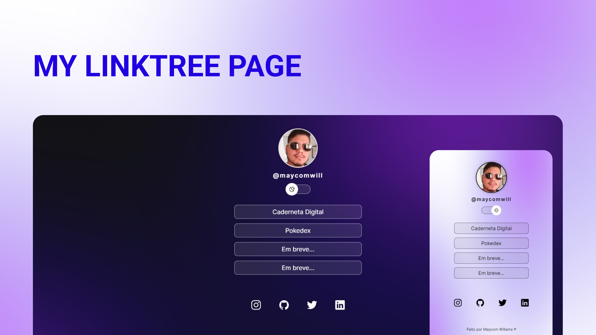

<h1 align="center"> LinkTree Like </h1>

Projeto desenvolvido para obter uma página estilo linktree.  

  <a href="#-tecnologias">Tecnologias</a>&nbsp;&nbsp;&nbsp;|&nbsp;&nbsp;&nbsp;
  <a href="#-projeto">Projeto</a>&nbsp;&nbsp;&nbsp;|&nbsp;&nbsp;&nbsp;
  <a href="#memo-licença">Licença</a>

  

 

  

## 🚀 Tecnologias

Esse projeto foi desenvolvido com as seguintes tecnologias:

 

## 💻 Projeto

Esse projeto é um agregador de links para usar como cartão de visitas online.

- [Acesse o projeto finalizado, online](https://maycomwill.github.io/Linktree-like/)

## :memo: Licença

Esse projeto está sob a licença MIT.
